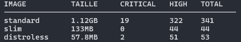
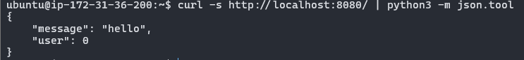
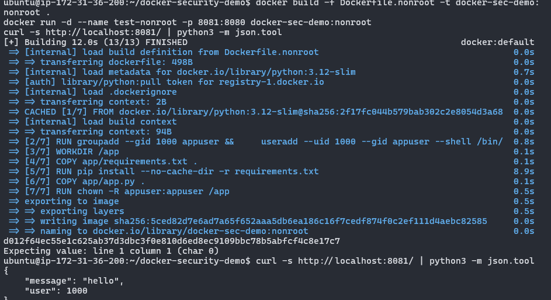
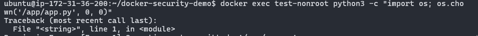
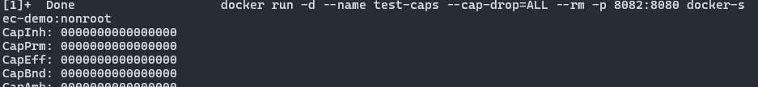
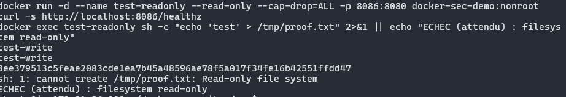
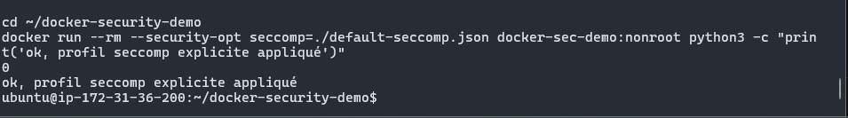
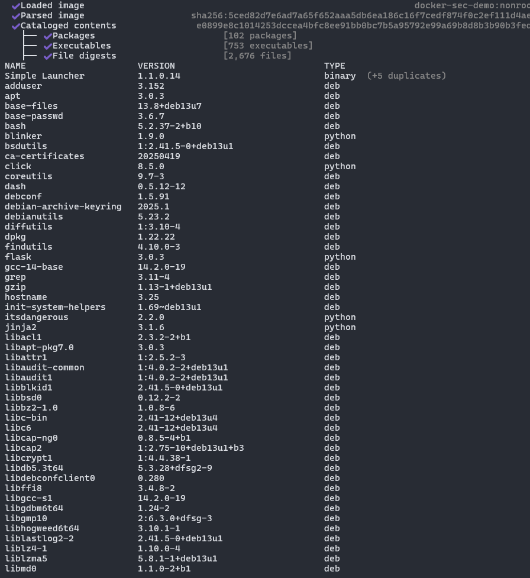

# 🔒 Docker Security Demo — Rootless & bonnes pratiques de durcissement


Une même application Flask minimale, buildée et durcie progressivement à travers **7 pratiques de sécurité concrètes** — chaque manche apporte une preuve mesurable (taille, CVE, capabilities, permissions), pas juste une affirmation.

## Pourquoi ce projet

La plupart des tutoriels Docker s'arrêtent à `docker build` / `docker run`. Peu montrent le durcissement qu'on attend réellement en entreprise : utilisateur non-root, capabilities réduites, filesystem read-only, traçabilité des dépendances. Ce repo comble ce vide avec des preuves à l'appui, pas de la théorie.

## Sommaire

- [Architecture du durcissement](#architecture-du-durcissement)
- [Synthèse avant/après](#synthèse--avant--après)
- [Les 7 manches](#les-7-manches)
- [Compétences démontrées](#compétences-démontrées)
- [Reproduire](#reproduire)
- [Stack](#stack)

---

## Architecture du durcissement

```mermaid
flowchart TD
    A["Image de base<br/>python:3.12 (1.12 GB)"] -->|distroless| B["Image minimale<br/>57.8 MB, moins de CVE"]
    B --> C["Utilisateur non-root<br/>UID 1000, sans shell"]
    C --> D["Capabilities<br/>--cap-drop=ALL"]
    D --> E["Filesystem read-only<br/>--read-only"]
    E --> F["--no-new-privileges<br/>+ profil seccomp explicite"]
    F --> G["SBOM<br/>Syft, 102 paquets tracés"]
    G --> H(["Image durcie finale<br/>prête pour la prod"])

    style A fill:#3b1f1f,stroke:#a33
    style H fill:#1f3b2a,stroke:#3a3
```



---

## Synthèse — avant / après

| Pratique | Par défaut | Durci |
|---|---|---|
| Image de base | `python:3.12` (1.12 GB) | `distroless` (57.8 MB) |
| CVE HIGH/CRITICAL (Trivy) | 341 (standard) | 53 (distroless) |
| Utilisateur | root (UID 0) | non-root dédié (UID 1000) |
| Capabilities Linux | ~14 par défaut | 0 (`--cap-drop=ALL`) |
| Filesystem | inscriptible | read-only (`--read-only`) |
| Élévation de privilèges | possible (binaires setuid) | bloquée (`--security-opt no-new-privileges:true`) |
| Syscalls autorisés | profil implicite Docker | profil explicite documenté |
| Traçabilité des dépendances | aucune | SBOM généré (Syft — 102 paquets, 753 exécutables) |

---

## Les 7 manches

### 1. Image de base — taille et surface d'attaque

Comparaison `python:3.12` / `python:3.12-slim` / `distroless`, même application, scan Trivy (CVE HIGH/CRITICAL) sur chacune.



### 2. Utilisateur non-root

L'application tourne par défaut en root (UID 0) dans le conteneur. Un utilisateur dédié, sans shell, sans home directory, élimine ce risque.

**Avant :**


**Après :**


**Preuve complémentaire** — même avec un utilisateur non-root actif, une tentative d'élévation (`chown` vers root) est bloquée :



### 3. Capabilities Linux

`--cap-drop=ALL` retire les ~14 capabilities accordées par défaut par Docker.



### 4. Filesystem read-only

`--read-only` empêche toute écriture sur le disque du conteneur, tout en vérifiant que l'application continue de répondre normalement.



### 5. `--no-new-privileges` & profil seccomp

Blocage de toute élévation de privilèges via binaire setuid, combiné à un profil seccomp explicite (plutôt qu'implicite) filtrant les syscalls autorisés.



### 6. SBOM — traçabilité des dépendances

Inventaire complet généré avec Syft (format SPDX) : chaque paquet, sa version, son type.



---

## Compétences démontrées

- **Durcissement d'image** : réduction de surface d'attaque mesurée (image de base, CVE)
- **Principe du moindre privilège** : utilisateur non-root, capabilities minimales, syscalls filtrés
- **Défense en profondeur** : plusieurs couches indépendantes (user, capabilities, filesystem, seccomp) plutôt qu'un seul mécanisme
- **Traçabilité supply chain** : génération de SBOM, préparation à la signature d'image (Cosign)
- **Méthode de preuve** : chaque affirmation de sécurité est vérifiée par une commande et son résultat, pas juste énoncée

---

## Reproduire

```bash
# Build des 3 images de base
docker build -f Dockerfile.standard -t docker-sec-demo:standard .
docker build -f Dockerfile.slim -t docker-sec-demo:slim .
docker build -f Dockerfile.distroless -t docker-sec-demo:distroless .

# Comparatif taille + CVE
./compare.sh

# Build de la version durcie (non-root)
docker build -f Dockerfile.nonroot -t docker-sec-demo:nonroot .

# Lancer avec toutes les protections combinées
docker run -d \
